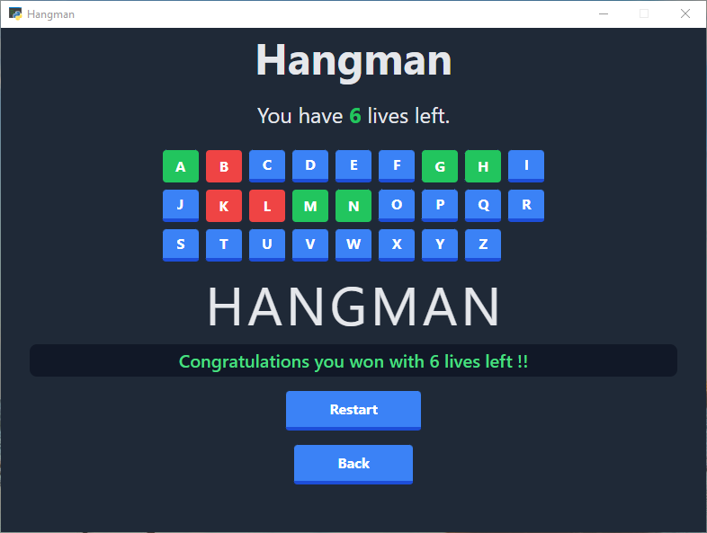
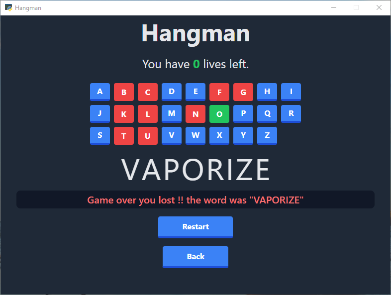
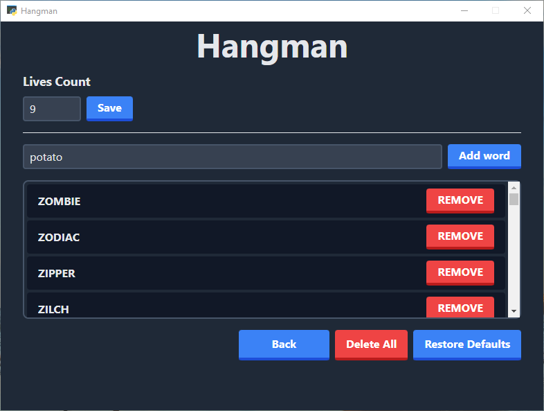

# Hangman
a simple Hangman game with gui using flask and pywebview

Dependencies:
 - Tailwind CSS for styling
 - HTML, CSS, Javascript
 - Python webview
 - SQLAlchemy
 - Flask 

## Installation

* Clone the repo to your local machine
```bash
git clone https://github.com/riad-azz/hangman.git
```

* Install the requirements
```bash
pip install -r requirements.txt
```

## Executing the program

* Run the main script
```bash
python main.py
```

## Program preview

* Winning screen



* Losing screen



* Settings screen


